<h1 align="center">Hi 👋, I'm Veera Venkata Sai Ram Saladi</h1>

<h3 align="center">
Software Developer | Python Full Stack | AWS Cloud | AI & ML
</h3>

<p align="center">
  <a href="https://github.com/SaiRamSaladi">
    
  </a>
  <a href="https://github.com/SaiRamSaladi?tab=followers">
    
  </a>
</p>

<p align="center">
  <a href="https://www.linkedin.com/in/sairamsaladi">
    
  </a>
  <a href="mailto:saladisairam01@gmail.com">
    
  </a>
</p>

---

## 👨‍💻 About Me

I'm a Computer Science (AI & ML) graduate focused on building practical
software solutions using Python, Full Stack Development, AWS Cloud,
and AI/ML technologies.

- 🔭 Currently working on **Python Full Stack Projects**
- 🌱 Currently learning **Core Python, Advanced Python, Django, REST APIs, SQL, AWS, Git & GitHub**
- 👯 Looking to collaborate on **Python Full Stack, AI/ML, Cloud & Software Development Projects**
- 🤝 Looking for help with **Advanced Python, Full Stack Development, AWS Cloud & AI/ML**
- 💬 Ask me about **Python, DSA, AWS, AI/ML & Full Stack Development**
- 📫 Email: **saladisairam01@gmail.com**
- 📄 Resume: **[View My Resume](YOUR_RESUME_LINK)**

---

## 🛠️ Technologies & Tools

### 💻 Programming

<p>
  
</p>

### 🌐 Full Stack Development

<p>
  
</p>

### ☁️ Cloud & Databases

<p>
  
</p>

### 🔧 Development Tools

<p>
  
</p>

---

## 🚀 Featured Projects

### ☁️ Student Vault – AWS

**Serverless Student Record Management System**

**Tech:** Python • AWS Lambda • API Gateway • DynamoDB • Postman

- Built a serverless student record management application
- Implemented REST APIs using API Gateway and AWS Lambda
- Used DynamoDB for storing and managing student records
- Tested API endpoints using Postman

🔗 [View Repository](https://github.com/SaiRamSaladi/Student-Vault-AWS)

---

### 🤖 Face Emotion Detection

**Real-Time Facial Emotion Recognition System**

**Tech:** Python • OpenCV • TensorFlow • CNN

- Developed a computer vision application for facial emotion recognition
- Used OpenCV for face detection and image processing
- Trained a CNN-based model using TensorFlow
- Designed for real-time emotion prediction

🔗 [View Repository](https://github.com/SaiRamSaladi/Face-Emotion-Detection)

---

### 🚦 Traffic Violation Reporter

**AI-Powered Traffic Violation Reporting System**

**Tech:** Python • AWS Rekognition • AWS Bedrock • Cognito • DynamoDB • EC2 • Streamlit

- Developed an AI-powered traffic violation reporting application
- Integrated AWS services for authentication, computer vision and data storage
- Used Amazon Rekognition for image analysis
- Used DynamoDB for storing application data
- Built the application interface using Streamlit

🔗 [View Repository](https://github.com/SaiRamSaladi/Traffic-Violation-Reporter)

---

### 📝 Complaint Care

**Full Stack Complaint Management System**

**Tech:** React • Node.js • Express.js • MongoDB

- Developed a full-stack complaint management application
- Implemented complaint submission and tracking
- Added user and administrative functionality
- Used MongoDB for application data management

🔗 [View Repository](https://github.com/SaiRamSaladi/Complaint-Care)

---

## 🧠 Coding & Problem Solving

<p align="center">

<a href="https://leetcode.com/saladisairam">

</a>

<a href="https://www.hackerrank.com/sairamsaladi">

</a>

<a href="https://www.codechef.com/users/sairam_42i7">

</a>

<a href="https://codeforces.com/profile/sairamsaladi">

</a>

<a href="https://auth.geeksforgeeks.org/user/saladisa5wu7">

</a>

</p>

---

## 📊 GitHub Statistics

<p align="center">
  
</p>

<p align="center">
  
</p>

---

## 🔥 Contribution Streak

<p align="center">
  
</p>

---

## 🎓 Certifications

- ☁️ **AWS Certified Developer – Associate**
- 🤖 **Microsoft Certified: Azure AI Fundamentals (AI-900)**
- 🐍 **IT Specialist – Python**
- ☕ **IT Specialist – Java**
- ☁️ **AWS Academy Cloud Foundations**

---

## 📚 Currently Learning

```text
Python
├── Core Python
├── Advanced Python
├── OOP
├── Exception Handling
├── Modules & Packages
└── Advanced Python Concepts

Full Stack Development
├── Django
├── REST APIs
├── SQL
├── HTML
├── CSS
├── JavaScript
└── React

AWS Cloud
├── EC2
├── S3
├── IAM
├── Lambda
├── API Gateway
├── DynamoDB
└── CloudWatch

Developer Tools
├── Git
├── GitHub
├── Postman
└── Docker
 check github statics are not working so plase check 
